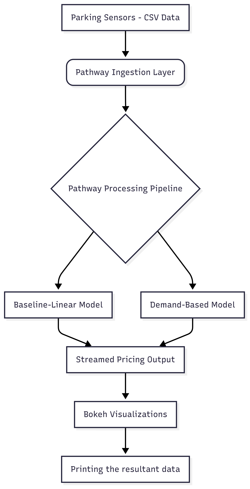

# Dynamic Parking Pricing System
  !! The Pathway specific report is in the Capstone Project pdf uploaded. !!

## Overview
This is a project that I made as a 1-week final project for the Summer Analytics'25 by IIT Guwahati. 
This project implements a dynamic pricing system for urban parking lots using **pathway data streams**. The goal is to adjust parking prices based on **occupancy**, **queue length**, **local traffic**, **vehicle types**, and **competitor prices**, helping manage congestion and maximize revenue.
The Project demanded that the data streams should be real time, but I couldn't figure out how to do that with Pathway. Therefore, I did it using the "static" mode of data streaming.
The pathway implementation is in google cloud and the EDA + python implementation part is in the Jupyter notebook uploaded (DynamicPricingModel_python.ipynb).

## Architecture Diagram

- Project Architecture & Workflow :
  1. Data Ingestion - Parking data is ingested via csv file in static mode in Pathway and using Pandas in Python
  2. Processing Pipeline - Process the data using two models:
       a. Baseline Linear Model - Computes price as `BasePrice + α * OccRate`
       b. Demand-Based Model - More factors are added using custom demand function, `FinalPrice = BasePrice * (1 + λ * Demand)`
  3. Visualization & Output - Prices are visualized for each parking lot using Bokeh and Matplotlib

## Additional Documents
 1. Well-commented Google Colab notebook is included - https://colab.research.google.com/drive/1ILEkRBQXTRK-68uVJWzNPKgKmos9qA0Y?usp=sharing
 2. The PDF report explaining all assumptions, demand function, and graphs can be found in the repo.
